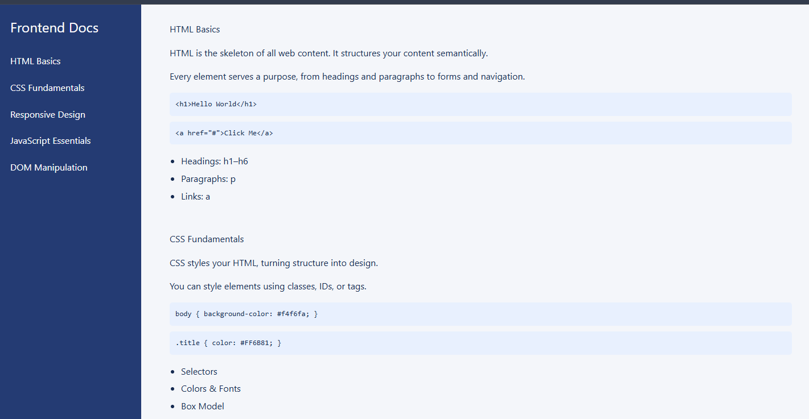

# Frontend Development – Technical Documentation Page

A clean, fully responsive technical documentation layout built with **HTML and CSS**.  
This project demonstrates structured documentation design, fixed navigation patterns, semantic markup, and responsive layout techniques.

## Live Demo
https://sharpsanders.github.io/technical-documentation-page/



---

## Project Overview

This documentation page explains core frontend development concepts:

- HTML Basics  
- CSS Fundamentals  
- Responsive Design  
- JavaScript Essentials  
- DOM Manipulation  

The layout follows the freeCodeCamp “Technical Documentation Page” requirements while applying a modern, readable visual design.

---

## Layout Structure

### Navigation
- Fixed left-side sidebar on desktop
- Converts to full-width top navigation on mobile
- Anchor links scroll to individual sections (`#HTML_Basics`, `#CSS_Fundamentals`, etc.)

### Main Content
Each section includes:
- A semantic `<header>`
- Descriptive text content
- Formatted `<code>` examples
- Supporting bullet lists

---

## Responsive Design

- Sidebar becomes full-width under `768px`
- Main content shifts to single-column layout
- Navigation spacing adjusts for stacked mobile links
- Layout maintains readability across desktop, tablet, and mobile

---

## Styling Highlights

### Navigation
- `position: fixed` sidebar (desktop)
- Full viewport height
- Deep blue background (`#243B73`)
- Subtle hover transition with padding shift
- Accent hover color (`#FF6B81`)

### Main Content
- Off-white reading background (`#f4f6fa`)
- Increased line-height for readability
- Clear visual hierarchy for headings and sections

### Code Blocks
- Light blue background
- Monospace font
- Rounded corners for contrast and clarity

---

## Sections Included

1. **HTML Basics**
   - Headings, paragraphs, links
   - Example tag structure

2. **CSS Fundamentals**
   - Selectors
   - Colors
   - Box model
   - Sample CSS snippets

3. **Responsive Design**
   - Media queries
   - Fluid images
   - Mobile-first principles

4. **JavaScript Essentials**
   - Variables
   - Functions
   - Console logging
   - Events

5. **DOM Manipulation**
   - Selecting elements
   - Updating content
   - Adding/removing classes

---

## Tech Stack

- HTML5 (semantic structure)
- CSS3 (layout, responsiveness, visual styling)
- No JavaScript required

---

## Project Structure

```txt
technical-documentation-page/
  index.html
  styles.css
What This Demonstrates
Building structured multi-section documentation layouts

Implementing fixed navigation with anchor linking

Writing semantic, accessible HTML

Creating responsive layouts using media queries

Designing readable documentation-focused UI

Potential Enhancements
Smooth scrolling for navigation links

Active section highlighting on scroll

Collapsible navigation for mobile

Dark/light theme toggle

Author
Created by Trevyn Sanders.

